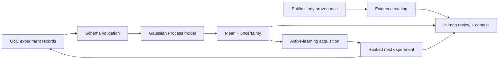

# ChipWise architecture

The evidence catalog and the synthetic quantitative model are deliberately separated. Public-study metadata grounds the use case and provenance; synthetic values demonstrate the closed-loop planner without misrepresenting literature measurements.
